# BazyDanych2
## Instalacja i konfigurowanie systemu: Administracja RP
0. Zalecane jest stworzenie wirtualnego środowiska
1. Sklonuj repozytorium na komputer/server hostujący aplikacje
2. w terminalu użyj komendy `pip install django mysqlclient django-crispy-forms django-bootstrap4 `
3. Aby stworzyć użytkownika z uprawnieniami administratora wejdź do folderu z aplikacją i w terminalu wpisz `python .\manage.py createsuperuser`
4. Uzupełnij wymagane dane
5. Aby uruchomić aplikację: `python .\manage.py runserver`
6. Aplikacja połączy się z naszymi serverami automatycznie.
7. Aplikacja powinna działać na zdefiniowanym w kontrakcie ip/domenie

## Instrukcja użytkowania aplikacji- administrator bazy danych:  
Do nadzoru aplikacji sugerujemy wykorzystanie panelu administratora, który dostępny jest dla użytkownika pod adresem: `ip/admin` lub `nazwadomoenyinternetowej/admin`. Dostęp wymaga zalogowania za pomocą danych, podanych podczas tworzenia użytkownika z uprawnieniami administratora. 

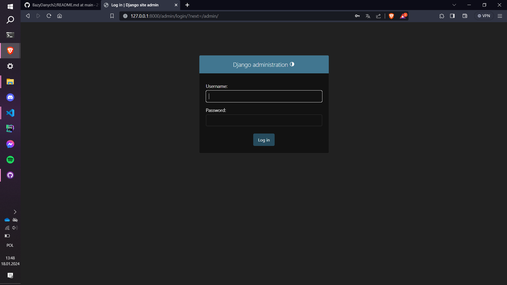
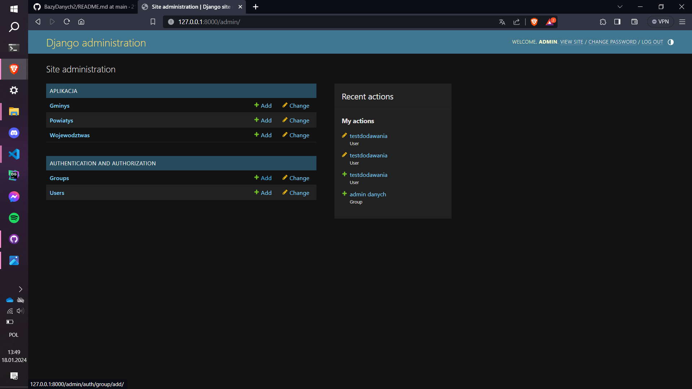

Po zalogowaniu administrator ma dostęp do panelu za pomocą, którego może edytować danymi "zaciągniętymi" z bazy danych przez aplikację, dodawać nowe oraz edytować i usuwać istniejące. 
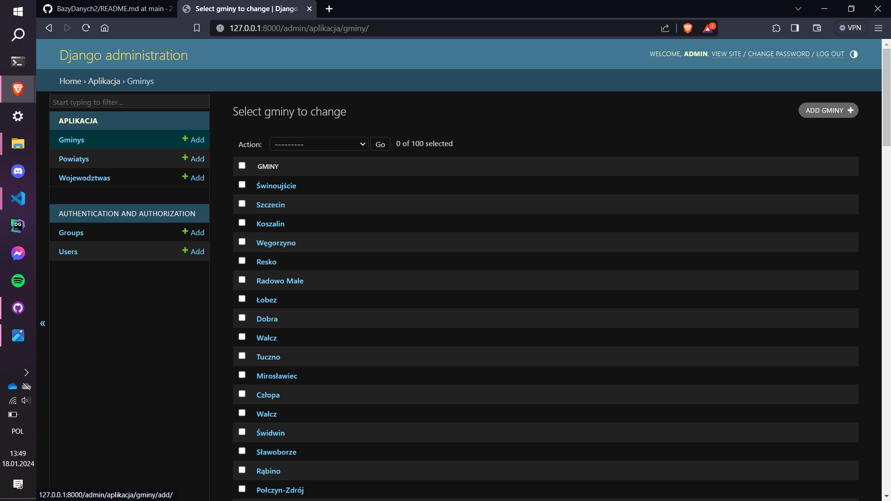
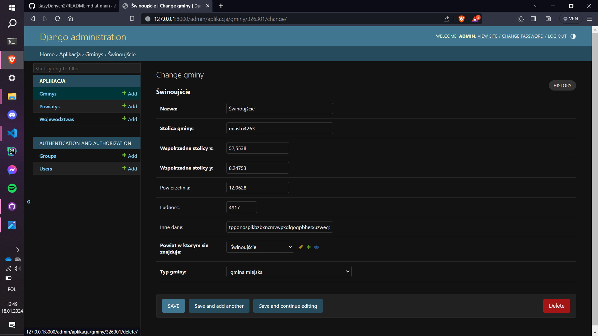

Administrator może również za pomocą aplikacji dodawać, usuwać oraz edytować użytkowników (kolejnych administratorów, administratorów danych bądź zdefiniowanych przez siebie) oraz przypisywać im grupy z odpowiednimi uprawnieniami.
- Dodawanie użytkowników
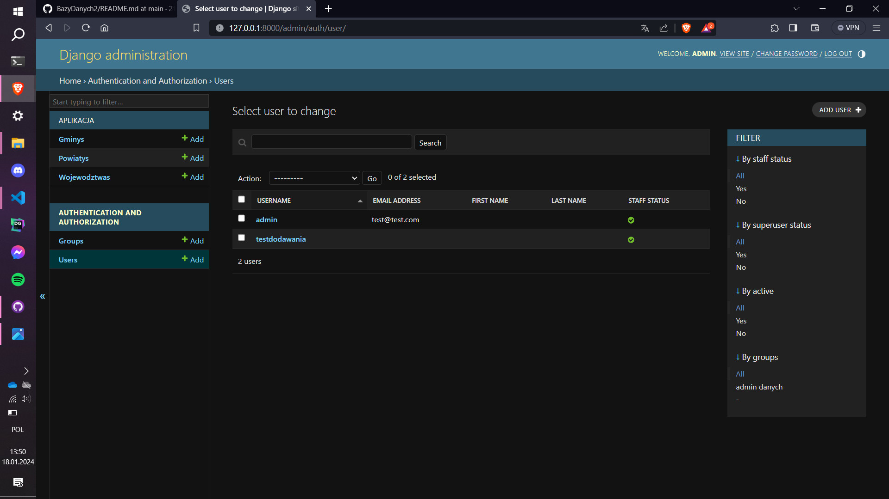
- Edytowanie i usuwanie użytkowików:
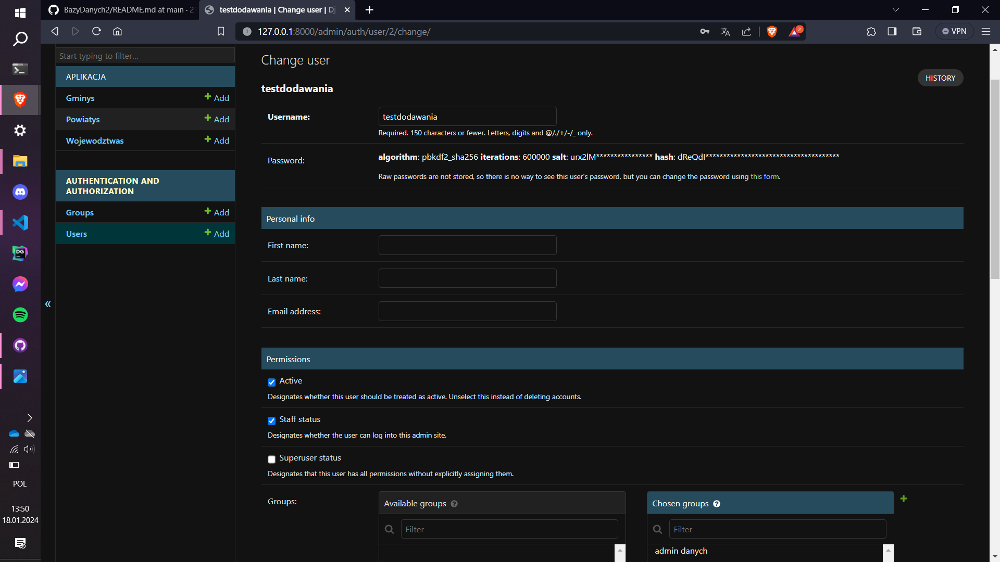  
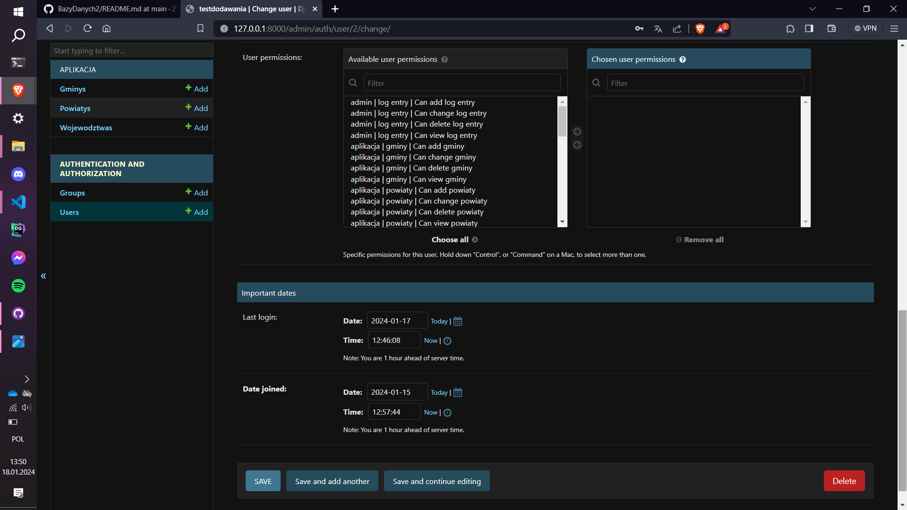
- Tworzenie grup:
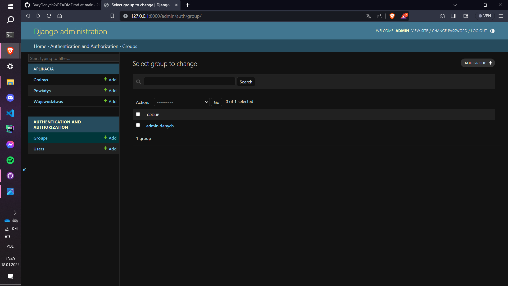
- Edycja i usuwanie grup
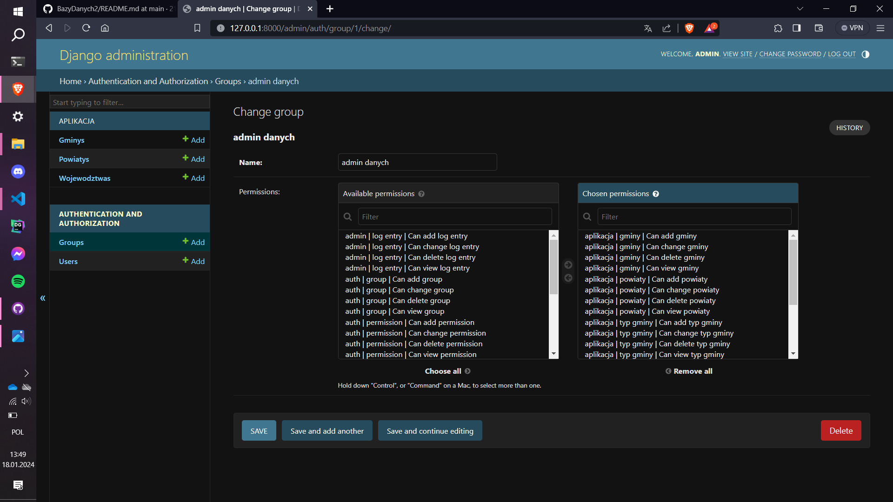

## Instrukcja użytkowania aplikacji- administrator danych
Konta administratorów danych będą tworzone przez administrartora bazy danych, z użyciem panelu administracyjnego. Hasło użytkownika musi mieć więcej niż 8 znaków w tym znaki i litery.

Aby zalogować się jako administrator danych, użytkownik na stronie głównej musi nacisnąć przycisk zaloguj:

Po naciśnięciu przycisku bedzie musiał podać swoje dane uwierzytelniające:

W przypadku podania złych danych zostanie wyświetlony komunikat:

Jeśli ktoś chciałby uzyskać dostęp do panalu administratora danych, bez wcześniejszego zalogowania np. wykorzystując URL, otrzyma poniższy komunikat:
 

Po zalogowaniu administrator danych będzie mieć dostęp do poniższego panelu:

Administator danych może dodawać Gminy, Powiaty oraz Województwa za pomocą przycisku.

W celu edytowania lub usunięcia danych administrator musi wybrać jaki obiekt usunąć. **W tym przykladzie posłużymy się powiatami, jednak proces jest taki sam dla pozostałych jednostek terytorialnych!**

Po wybraniu powiatów pokazuje nam się lista wszystkich powiatów:

Następnie wybieramy interesujący nas powiat i wyświetla sie nam panel edycji z opcją usunięcia obiektu:

## Instrukcja użytkowania aplikacji- niezalogowany użytkownik
Po wpisaniu nr ip/nazwy domeny internetowej użytkownik zostanie skierowany na stronę główną. Na stronie głównej użytkownik będzie miał opcje zalogowania się, jeśli jest pracownikiem, lub korzystania dalej jako niezalogowany użytkownik (dalej również nazywany NZU).
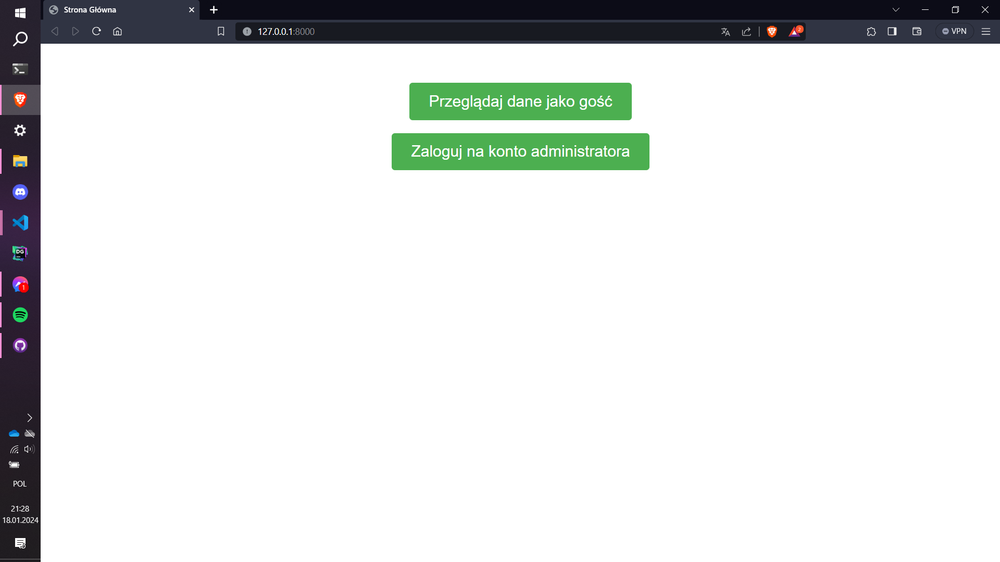
 Jako NZU, użytkownik będzie miał do wyboru:
### Funkcjonalności dla niezalogowanego użytkownika
1. Wyszukiwanie województw
2. Wyszukiwanie powiatów
3. Wyszukiwanie gmin
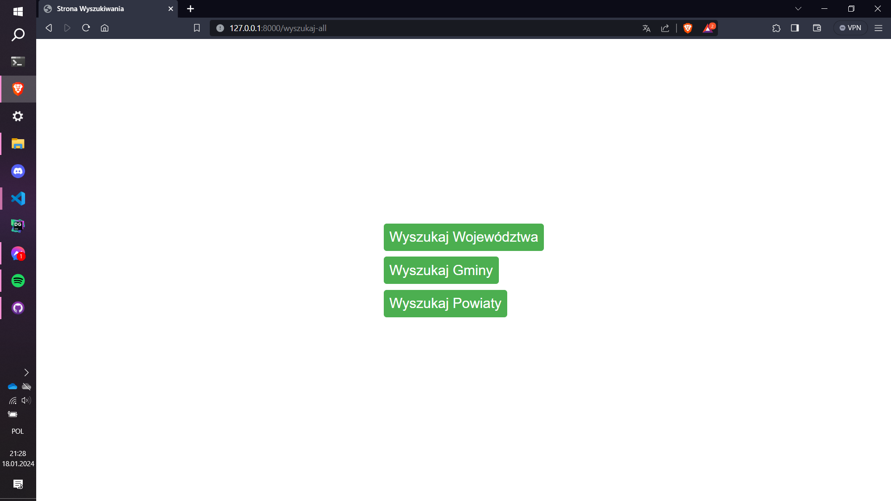
**Dla przykładu zaprezentowano opcje wyszukania Gminy. Dla wyszukiwania powiatów i województw kroki będą jednakowe**
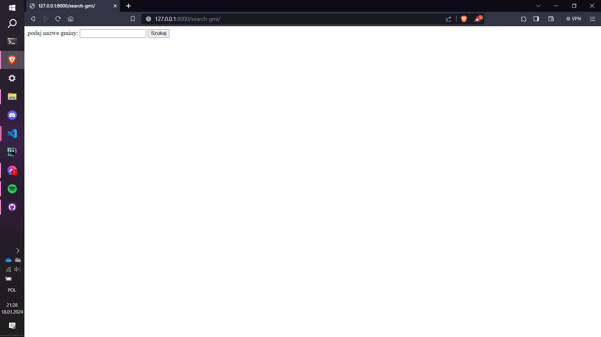
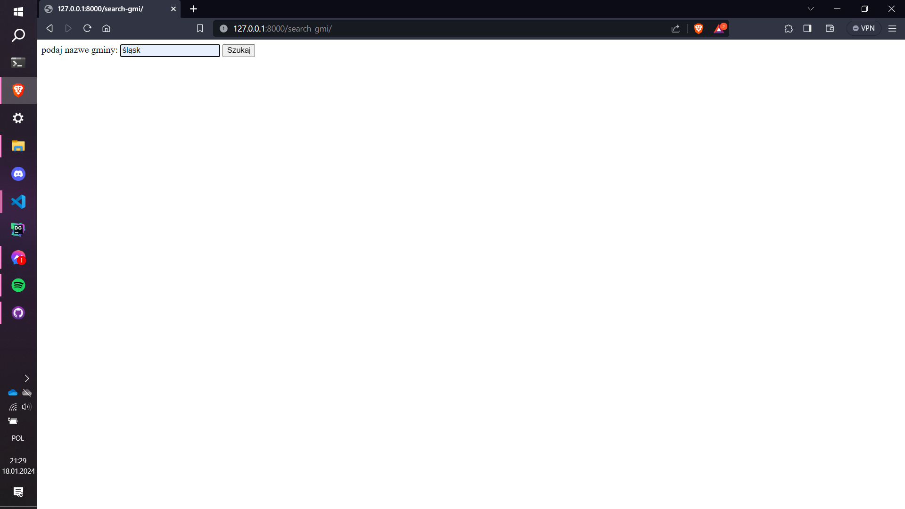
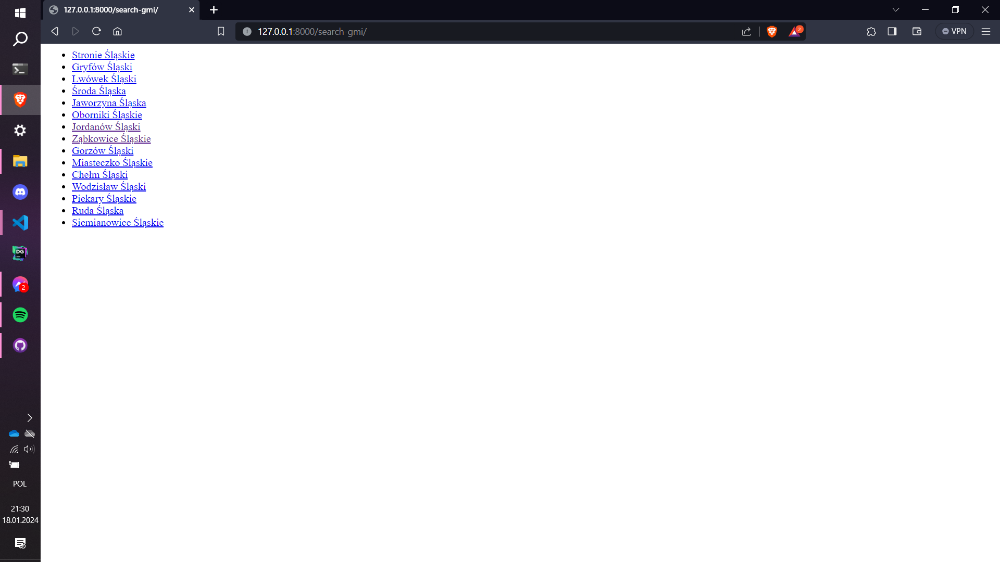

Po wyszukaniu interesujacych użytkownika danych po nazwie, użytkownik może sprawdzić szczegóły interesującego go wyniku np.: dla gminy będzie to:
- nazwa
- id z terytu
- populacja
- powierzchnia
- powiat w którym się znajduje
- stolica gminy
- typ gminy
- współrzędne geograficzne x oraz y stolicy gminy
- inne dane
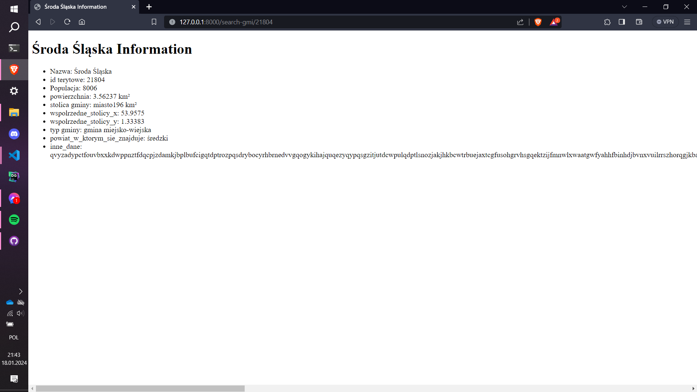

Dla powiatu użytkowik będzie miał podgląd do inforamcji takich jak:
- nazwa
- id z terytu
- stolica powiatu
- współrzędne geograficzne x oraz y dla miasta powiatowego
- powierzchnia powiatu
- ludność powiatu
- typ powiatu
- województwo, w którym znajduje się powiat
- inne dane

Dla wojewodztwa użytkowik będzie miał podgląd do inforamcji takich jak::
- nazwa
- id z terytu
- miasto wojewódzkie
- współrzędne geograficzne x oraz y dla miasta wojewódzkiego
- powierzchnia województwa
- ludność województwa
- drugie miasto wojewódzkie 
- współrzędne geograficzne x oraz y dla drugiego miasta wojewódzkiego
- inne dane

NZU nie będzie mieć dostępu do funkcji modyfikujących zawartość bazy danych przez względy bezpieczeństwa. Zmiany do bazy danych mogą wprowadzać tylko uprawnieni pracownicy.

## Testowanie opracowanych funkcji systemu
wszystkie funkcjonalności użytkownika zostały uważnie przetestowane, przez światowej klasy testerów manualnych specjalistów od cyberbezpieczeństwa. Po każdej aktualizacji i dodaniu nowej funkcjonalności aplikacja była testowana na losowo wybranej grupie badawczej.

## Omówienie rozwiązań programistycznych
Aplikacja korzysta ze standardowej struktury proejktu Django.

Wybraliśmy architekturę MVT (stosowana przez Django) i różniącą się w swoich założeniach od architektry MVC. (widoki skupione na logice, a nie prezentacji danych etc.)

W części aplikacji dostępnej dla NZU, nie zdecydowaliśmy się na dynamiczne przekierowywanie użytkownika. 

Aplikacja nie korzysta z zewnętrznych zależności, nie licząc wcześniej wspomnianego `mysqlclient`. Zapewnia to większe bezpieczeństwo, poprzez minimalizacje ryzyka wystąpienia błędów lub szkodliwego oprogramowania.

### Implementacja interfejsu dostępu do bazy danych
Do połączenia się z bazą danych wykorzystaliśmy wbudowany w django 'connector' do baz mySQL, jednak by móc z niego skorzystać musieliśmy pobrać pakiet `mysqlclient`, który dostarcza niskopoziomowy interfejs do komunikacji z bazą danych MySQL.

Połączenie z bazą danych odbyło się w bardzo prosty sposób poprzez ustawienie odpowiednich wartości w słowniku DATABASES, przechowywanym w pliku z ustawieniami aplikacji Django.

Modele Django wykorzystywane do reprezentacji obiektów z bazy danych wygenerowaliśmy za pomocą komendy wbudwanej w django `python manage.py inspectdb`.

Za pomocą naszej aplikacji można wykonywać wszystkie operacje CRUD (Create, Read, Update, Delete).

### Mechanizmy bezpieczeństwa
W naszej aplikacji wykorzystaliśmy domyślne zabezpieczenia Django takie jak:
- sprawdzenie czy hasło ma min. 8 znaków
- czy hasło nie jest w bazie najpopularniejszych haseł
- czy hasło nie składa się z samych cyfr
- czy hasło nie pokrywa się za bardzo z atrybutami użytkownika

Dodatkowo korzystamy również z wbudowanych w django funkcjonalności takich jak:

1. **Cross Site Scripting (XSS) Protection**: Django szablonuje silnik, który domyślnie zabezpiecza przed większością ataków XSS, poprzez automatyczne zabezpieczanie wyjścia szablonów.

2. **Cross Site Request Forgery (CSRF) Protection**: Django ma wbudowane zabezpieczenia przeciwko atakom CSRF. Wymaga to użycia odpowiedniego znacznika w każdym formularzu, który prowadzi do zmiany danych.

3. **SQL Injection Protection**: Django chroni przed atakami SQL Injection poprzez użycie ORM (Object-Relational Mapping). Każde zapytanie do bazy danych jest automatycznie zabezpieczane.

4. **Clickjacking Protection**: Django ma wbudowane zabezpieczenia przeciwko atakom Clickjacking, poprzez użycie middleware `X-Frame-Options`.

5. **Host Header Validation**: Django chroni przed atakami, które mogą prowadzić do niebezpiecznego zachowania poprzez manipulację nagłówkiem hosta.

6. **Secure Password Handling**: Django używa bezpiecznych algorytmów do przechowywania haseł. Hasła są przechowywane jako "hash", co oznacza, że oryginalne hasło nie jest zapisywane i nie może być odzyskane.

7. **HTTPS Support**: Django obsługuje użycie HTTPS, co jest ważne dla bezpiecznej komunikacji w Internecie oraz ułatwi migrację strony z http na https.

