# Projekt Bazy Danych

## Model konceptualny
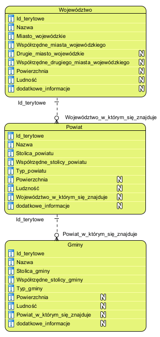

Nasz model odwzorowuje aktualny podział administracyjny Rzeczypospolitej Polski. Każda z tabel odwzorowuje odpowiadającą jej (tabeli) jednostkę administracyjną.

## Model logiczny
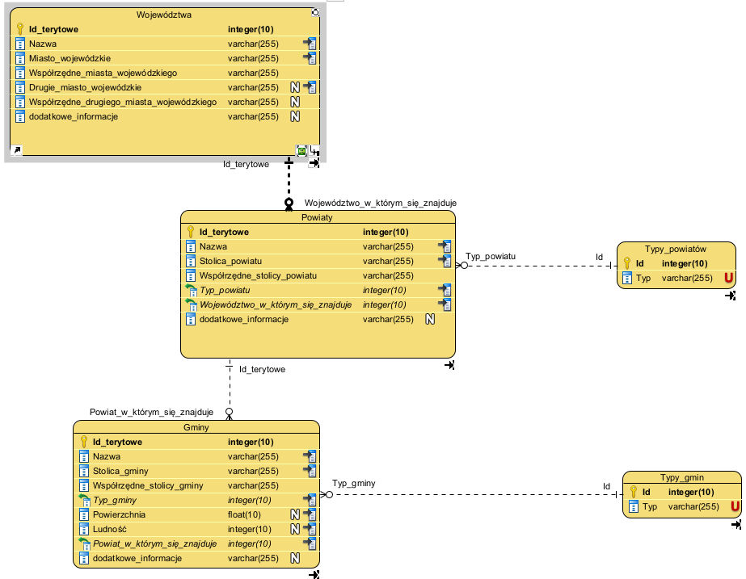

Zdecydowaliśmy się na dodanie tabel słownikowych w celu ograniczenia powtorzeń i ułatwienia zarządzania bazą danych.
### Model fizyczny
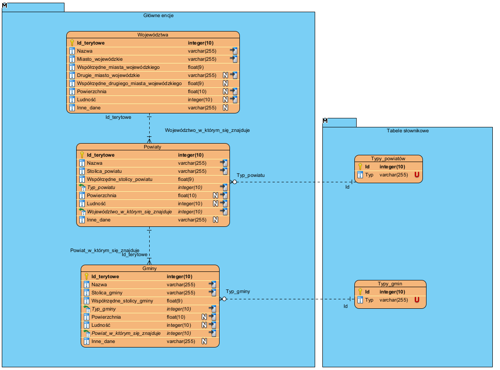
## Inne elementy bazy danych 

### Baza danych przechowuje tylko aktualny podział administracyjny Polski. Nie przechowuje ona historii edycji. 
### Wszystkie parametry tabel do jakich się odnosimy poniżej, takie jak "nazwa [nazwa jednostki administracyjnej]", "ludność [nazwa jednostki administracyjnej]" etc. Mają w swojej nazwie nazwę tabeli. To znaczy, że kiedy odwołujemy się do nazwy gminy, parametr "nazwa gminy" bierzemy z tabeli gminy. Nazwa jednostki administracyjnej jest nazwą tabeli.
### Poniżej może pojawić się zapis: "nazwa, stolica, ludność [nazwa jednostki administracyjnej]", w takim wypadku wszystkie parametry odnoszą się do tabeli wskazanej na końcu. Taki zapis poprawia czytelność i zwiększa przejrzystość dokumentacji. 

### Indeksy pojedyncze:
- Nazwa województwa (tab. wojewodztwa)
- Nazwa powiatu (tab. powiaty)
- Nazwa gminy (tab. gminy)
- Ludność województwa (tab. wojewodztwa)
- Ludność powiatu (tab. powiaty)
- Ludność gminy (tab. gminy)
- Powierzchnia województwa (tab. wojewodztwa)
- Powierzchnia powiatu(tab. powiaty)
- Powierzchnia gminy(tab. gminy)
- Miasto wojewódzkie (tab. wojewodztwa)
- Drugie miasto wojewódzkie (tab. wojewodztwa)
- Stolica powiatu (tab. powiaty)
- Stolica gminy(tab. gminy)
- Id terytowe województwa (tab. wojewodztwa)
- Id terytowe powiatu (tab. powiaty)
- Id terytowe gminy (tab. gminy)

### Indeksy podwójne:
- Nazwa województwa, stolica województwa(tab. wojewodztwa)
- Nazwa powiatu, stolica powiatu (tab. powiaty)
- Nazwa gminy, stolica gminy (tab. gminy)
- Nazwa powiatu, typ powiatu (tab. powiaty)
- Nazwa gminy, typ gminy (tab. gminy)

### Widoki:
- Widok pokazujący nazwę województwa, stolicę województwa, współrzędne stolicy województwa, możliwej drugiej stolicy województwa i powierzchnię województwa  
- Widok pokazujący nazwę powiatu, stolicę powiatu, współrzędne stolicy powiatu i  powierzchnię powiatu
- Widok pokazujący nazwę gminy, stolicę gminy, współrzędne stolicy gminy i  powierzchnię gminy
- Widok pokazujący nazwę gminy, stolicę gminy, typ gminy, to w jakim powiecie gmina się znajduje (nazwa powiatu) i w jakim województwie gmina się znajduje (nazwa województwa)
- Widok pokazujący nazwę powiatu, stolicę powiatu, typ powiatu, to w jakim województwie (nazwa województwa) powiat się znajduje i jakie gminy (nazwy gmin) znajdują się w tym powiecie
- Widok pokazujący nazwę województwa, stolicę województwa i możliwą drugą stolicę województwa, to jakie powiaty są w tym województwie (nazwy powiatów) i jakie gminy są w tym województwie (nazwy gmin)
- Widok pokazujący nazwę województwa, stolicę województwa, powierzchnię województwa, ludność województwa i inne dane województwa
- Widok pokazujący nazwę powiatu, stolicę powiatu, powierzchnię powiatu, ludność powiatu i inne dane powiatu
- Widok pokazujący nazwę gminy, stolicę gminy, powierzchnię gminy, ludność gminy i inne dane gminy

### Poziomy uprawnień:
- Użytkownik podstawowy, będzie mógł tylko odczytywać dane z bazy (dostęp do tablicy województw, powiatów i gmin typu read only).  
- Administrator danych, będzie mógł edytować informacje, które zawiera baza danych (dostęp do całej bazy, edycja danych, dodawanie rekordów, usuwanie ich)
- Administrator aplikacji, będzie mógł zarządzać bazą danych jak i tworzyć wymagane konta użytkowników, i wykonywać kopie zapasowe bazy danych

### Procedury składowane:
- Procedura realizująca dodawanie nowych województw do bazy danych
- Procedura realizująca dodawanie nowych powiatów do bazy danych
- Procedura realizująca dodawanie nowych gmin do bazy danych
- Procedura pozwalająca na edycję i aktualizację danych województw
- Procedura pozwalająca na edycję i aktualizację danych powiatów
- Procedura pozwalająca na edycję i aktualizację danych gmin
- Procedura pozwalająca na usuwanie województw (cascade delete)
- Procedura pozwalająca na usuwanie powiatów (cascade delete)
- Procedura pozwalająca na usuwanie gmin
- Procedura pozwalająca na wyszukiwanie województwa (nazwa województwa i powierzchnia województwa) według powierzchni z sortowaniem malejąco
- Procedura pozwalająca na wyszukiwanie powiatu (nazwa powiatu, powierzchnia powiatu) według powierzchni z sortowaniem malejąco
- Procedura pozwalająca na wyszukiwanie gmin (nazwa gminy, powierzchnia gminy) według powierzchni z sortowaniem malejąco
- Procedura pozwalająca na wyszukiwanie województwa (nazwa województwa, powierzchnia województwa) według powierzchni z sortowaniem rosnąco
- Procedura pozwalająca na wyszukiwanie powiatu (nazwa powiatu, powierzchnia powiatu) według powierzchni z sortowaniem rosnąco
- Procedura pozwalająca na wyszukiwanie gmin (nazwa gminy, powierzchnia gminy) według powierzchni z sortowaniem rosnąco
- Procedura pozwalająca na wyszukiwanie województwa (nazwa województwa, liczba ludności) według ludności z sortowaniem malejąco
- Procedura pozwalająca na wyszukiwanie powiatu (nazwa powiatu, liczba ludności) według ludności z sortowaniem malejąco
- Procedura pozwalająca na wyszukiwanie gmin (nazwa gminy, liczba ludności) według ludności z sortowaniem malejąco
Procedura pozwalająca na wyszukiwanie województwa (nazwa województwa, liczba ludności) według ludności z sortowaniem rosnąco
- Procedura pozwalająca na wyszukiwanie powiatu (nazwa powiatu, liczba ludności) według ludności z sortowaniem rosnąco
- Procedura pozwalająca na wyszukiwanie gmin (nazwa gminy, liczba ludności) według ludności z sortowaniem rosnąco
- Procedura pozwalająca na wyszukiwanie województwa (nazwa województwa) według nazwy z sortowaniem alfabetycznym A-Z
- Procedura pozwalająca na wyszukiwanie powiatu (nazwa powiatu) według nazwy z sortowaniem alfabetycznym A-Z
- Procedura pozwalająca na wyszukiwanie gmin (nazwa gminy) według nazwy z sortowaniem alfabetycznym A-Z
- Procedura pozwalająca na wyszukiwanie  województwa (nazwa województwa, stolica województwa) według stolic województw z sortowaniem alfabetycznym A-Z
- Procedura pozwalająca na wyszukiwanie powiatu (nazwa powiatu, stolica powiatu) według stolicy powiatu z sortowaniem alfabetycznym A-Z
- Procedura pozwalająca na wyszukiwanie gmin (nazwa gminy, stolica gminy) według stolicy gminy z sortowaniem alfabetycznym A-Z

### Triggery:
- Trigger after insert obliczający aktualną liczbę ludności w powiecie po dodaniu gminy do powiatu
- Trigger after delete obliczający aktualną liczbę ludności w powiecie po usunięciu gminy z powiatu
- Trigger after update obliczający aktualną liczbę ludności w powiecie po edycji danych gminy ludności w powiecie
- Trigger after insert obliczający aktualną liczbę ludności w województwie po dodaniu powiatu do województwa
- Trigger after delete obliczający aktualną liczbę ludności w województwie po usunięciu powiatu z województwa
- Trigger after update obliczający aktualną liczbę ludności w województwie po edycji danych ludności powiatu w województwie
- Trigger after insert obliczający aktualną powierzchnię województwa po dodaniu powiatu do województwa
- Trigger after delete obliczający aktualną powierzchnię województwa po usunięciu powiatu z województwa
- Trigger after update obliczający aktualną powierzchnię województwa po edycji danych powierzchni powiatu w województwie
- Trigger after insert obliczający aktualną powierzchnię powiatu po dodaniu gminy do powiatu
- Trigger after delete obliczający aktualną powierzchnię powiatu po usunięciu gminy z powiatu
- Trigger after update obliczający aktualną powierzchnię powiatu po edycji danych powierzchni gminy w powiecie

### Cascade:
- Cascade delete używany przy usuwaniu województwa (usuwa także przypisane do niego powiaty i gminy)
- Cascade delete używany przy usuwaniu powiatu (usuwa także przypisane do niego gminy)

### Dodawanie danych:
Przy dodawaniu nowego rekordu za pomocą operacji check następuje sprawdzenie czy liczba jest nieujemna (liczba ludności) lub dodatnia (powierzchnia), np.:    
- Przy dodaniu województwa:  
    - check powierzchnia > 0  
- Przy dodaniu powiatu:  
    - check powierzchnia > 0  
- Przy dodaniu gminy:  
    - check powierzchnia > 0  
    - check ludność >= 0  

## Projekt Aplikacji użytkownika

### Architektura aplikacji i diagramy projektowe
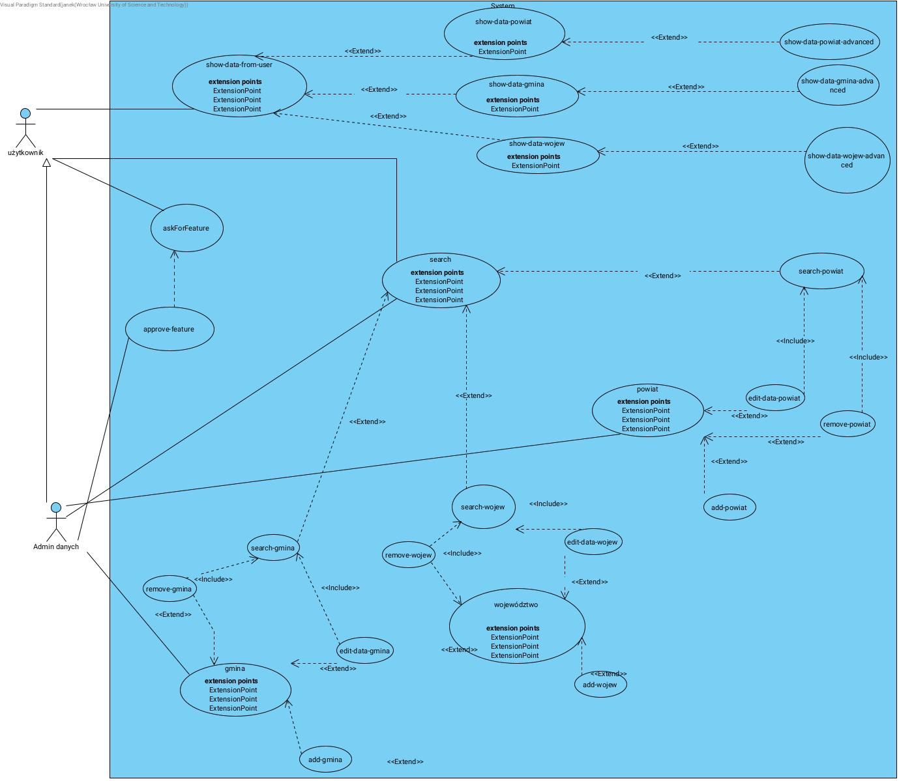

Powyższy schemat prezentuje przypadki użycia w naszej aplikacji oraz funkcje dostępne dla użytkowników aplikacji.
### interfejs graficzny struktura menu
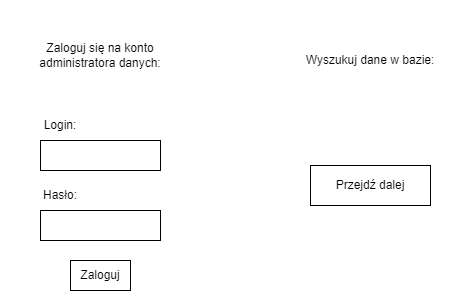  
ekran logowania  
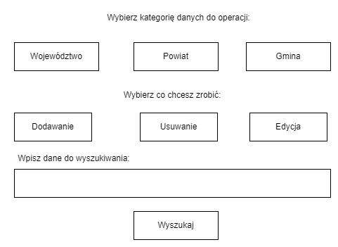  
Panel Administrator glowny  
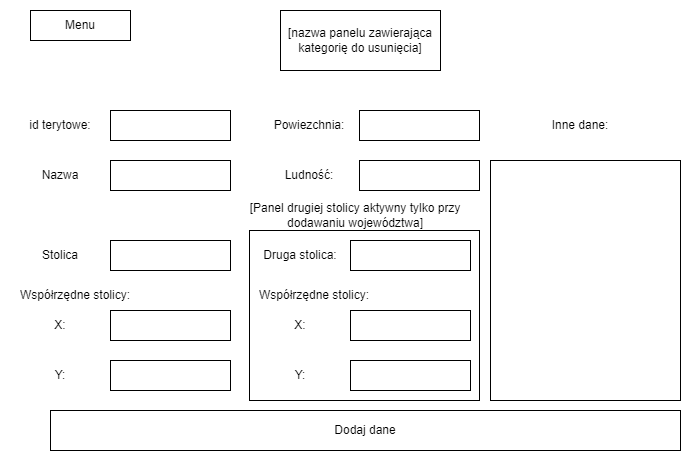  
Panel dodawania  
  
  
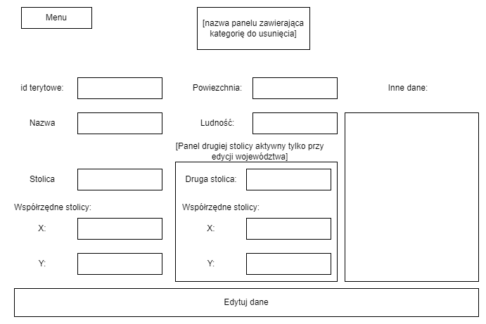  
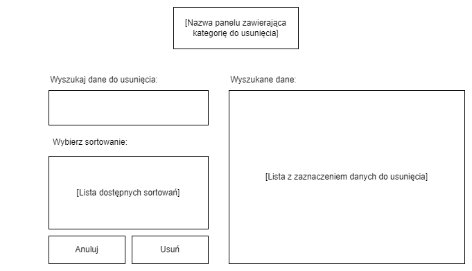  
Panel Edycji  
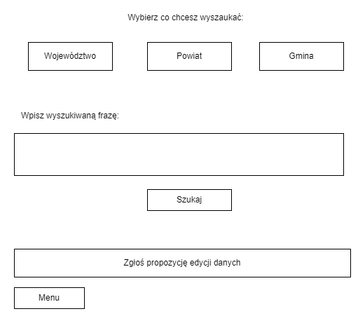  
Panel Uzytkownika  
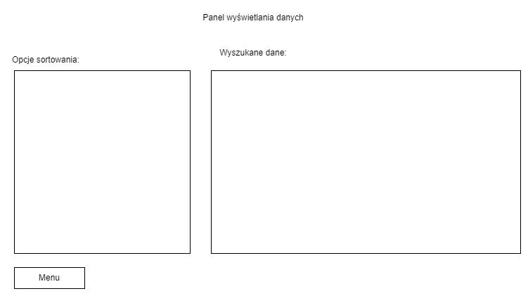  
Panel Uzytkownika Wyswiewtlanie  
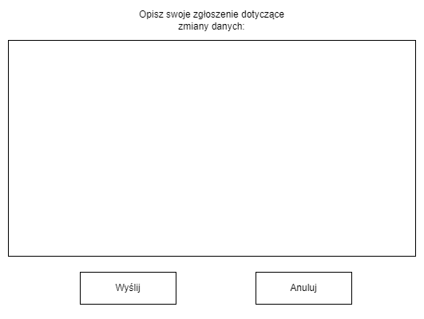  
zgloszenia  
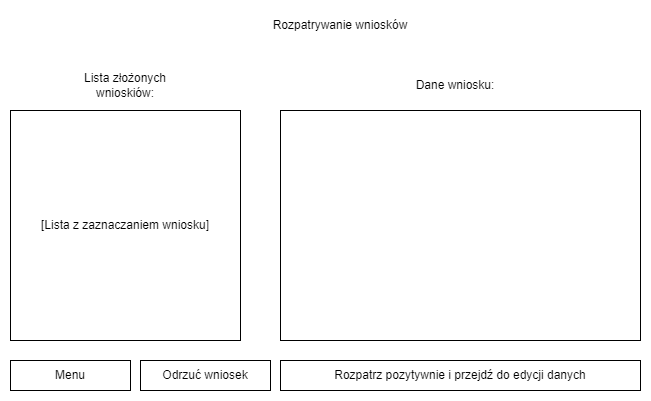  
Rozpatrywanie Wnioskow  

### Metoda podłączenia do bazy:
Aplikacja do podłączenia do bazy danych będzie wykorzystywać wbudowaną funkcję frameworku "django". Korzystanie z tej funkcji będzie gwarantować bezpieczeństwo oraz niezawodność połączenia.
### Projekt zabezpieczeń na poziomie abstrakcji:
Zabezpieczenie na poziomie abstrakcji będzie realizowane poprzez:
- logowanie użytkowników z prawami edycji
- przygotowane funkcje dodawania, usuwania oraz edycji danych  uniemożliwiające podanie danych w złym formacie